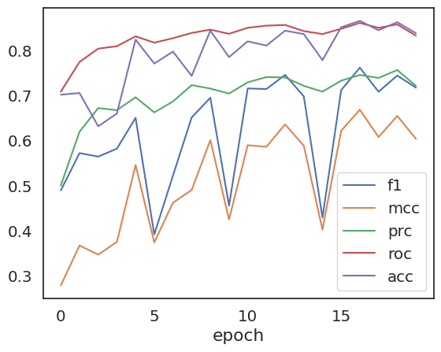

## Conceptor 

* Codebase: https://github.com/mims-harvard/conceptor
* Document: https://github.com/mims-harvard/conceptor-101/

## Download all required files

Please download all the files listed and save them to a folder on your local machine that you name, for example, the **./tmpignore** folder.

| File                                                                                                           | Description                                                                  |
| -------------------------------------------------------------------------------------------------------------- | ---------------------------------------------------------------------------- |
| [conceptor](https://drive.google.com/open?id=1pcxzWXf-zq21TOjrCf1fHX6Dwgq8MThm&usp=drive_copy)                 | Conceptor main code, add to your python path to import                       |
| [pretrainer.pt](https://drive.google.com/open?id=1JnsKsacRiw0bRVpdP6DxbueFc0RmqYO9&usp=drive_copy)             | Pretrained model on TCGA data                                                |
| [finetuner_all_40.pt](https://drive.google.com/open?id=1dtI_y4R_FXA0SFKnUIp_--d4ufKJEgE8&usp=drive_copy)       | Fintuned model on ALL ITRP data (early stopping on 40 epochs )               |
| [finetuner_all_50.pt](https://drive.google.com/open?id=1fRWLtTJF49bSjO13kdC20Y0qtLYCvHkT&usp=drive_copy)       | Fintuned model on ALL ITRP data (early stopping on 50 epochs )               |
| [finetuner_without_gide.pt](https://drive.google.com/open?id=1m95G1mMzdGngB1E-P15UucmR1vmKPNzi&usp=drive_copy) | Fintuned model on ALL ITRP data except Gide cohort (Gide for early stopping) |
| [ITRP_dataset.xlsx](https://drive.google.com/open?id=1oyIXRFrwRtC10gskbFmOffB54mW5O4MN&usp=drive_copy)         | The description of the ALL ITRP datasets                                     |
| [ITRP.PATIENT.TABLE](https://drive.google.com/open?id=1J5_b32-KhuSjxb8dOr9SVgG9ms3Bv21m&usp=drive_copy)        | The Patient clinical information of ITRP dataset                             |
| [ITRP.TPM.TABLE](https://drive.google.com/open?id=1VeKkzYjp51enwvFQw4OtxG08tfpYJYuT&usp=drive_copy)            | The Patient bulk-mRNA TPM value of ITRP dataset            

-----

## Install the dependency
In this example, we will demonstrate how to install the conceptor dependency and add it to our Python path for usage in this package.

* Step1: Go to the conceptor folder and install the dependency:
  ```bash
    cd conceptor
    pip install -r ./requirements.txt
  ```

* Step2: Now you can import conceptor by 

    ```python
    import sys
    sys.path.insert(0, './tmpignore/conceptor')
    from conceptor import FineTuner, loadconceptor
    ```

## Finetuing

Assume that all downloaded data, including the input datasets, concept code, and pre-trained checkpoint (pretrainer.pt) are placed in this directory: tmpignore/


```python
ls -lh ./tmpignore/
```

    do_ypcall: clnt_call: RPC: Timed out
    total 262M
    drwxrwxr-x 2 was966 was966 4.0K Mar 17 20:41 conceptor/
    -rw-rw-r-- 1 was966 was966  34M Mar 17 23:56 finetuner_all_40.pt
    -rw-rw-r-- 1 was966 was966  34M Mar 17 23:00 finetuner_all_50.pt
    -rw-rw-r-- 1 was966 was966  34M Mar 18 00:24 finetuner_without_gide.pt
    -rw-rw-r-- 1 was966 was966  769 Mar 17 20:19 gene_zip.ipynb
    -rw-rw-r-- 1 was966 was966 1.1M Mar 17 20:47 ITRP.PATIENT.TABLE
    -rw-rw-r-- 1 was966 was966 136M Mar 17 20:48 ITRP.TPM.TABLE
    -rw-rw-r-- 1 was966 was966  26M Mar 17 20:47 pretrainer.pt


```python
import sys

sys.path.insert(0,  './tmpignore/conceptor')
from conceptor.utils import plot_embed_with_label
from conceptor import PreTrainer, FineTuner, loadconceptor #, get_minmal_epoch
from conceptor.utils import plot_embed_with_label, plot_performance, score2
from conceptor.tokenizer import CANCER_CODE
```


```python
import os
from tqdm import tqdm
from itertools import chain
import pandas as pd
import numpy as np
import random, torch
import matplotlib.pyplot as plt
import seaborn as sns
sns.set(style = 'white', font_scale=1.3)
import warnings
warnings.filterwarnings("ignore")

def onehot(S):
    assert type(S) == pd.Series, 'Input type should be pd.Series'
    dfd = pd.get_dummies(S, dummy_na=True)
    nanidx = dfd[dfd[np.nan].astype(bool)].index
    dfd.loc[nanidx, :] = np.nan
    dfd = dfd.drop(columns=[np.nan])*1.
    cols = dfd.sum().sort_values(ascending=False).index.tolist()
    dfd = dfd[cols]
    return dfd
```

## load pretrainer and the datasets


```python
## load pretrainer
pretrainer = loadconceptor('./tmpignore/pretrainer.pt')

## read data
df_label = pd.read_pickle('./tmpignore/ITRP.PATIENT.TABLE')
df_tpm = pd.read_pickle('./tmpignore/ITRP.TPM.TABLE')
df_tpm.shape, df_label.shape
```


    ((1133, 15672), (1133, 110))


```python
train_idx = df_label[df_label.cohort != 'Gide'].index
test_idx = df_label[df_label.cohort == 'Gide'].index
```


```python

```


```python
df_tpm.head()
```


<div>
<style scoped>
    .dataframe tbody tr th:only-of-type {
        vertical-align: middle;
    }

    .dataframe tbody tr th {
        vertical-align: top;
    }

    .dataframe thead th {
        text-align: right;
    }
</style>
<table border="1" class="dataframe">
  <thead>
    <tr style="text-align: right;">
      <th></th>
      <th>A1BG</th>
      <th>A1CF</th>
      <th>A2M</th>
      <th>A2ML1</th>
      <th>A4GALT</th>
      <th>A4GNT</th>
      <th>AAAS</th>
      <th>AACS</th>
      <th>AADAC</th>
      <th>AADAT</th>
      <th>...</th>
      <th>ZWILCH</th>
      <th>ZWINT</th>
      <th>ZXDA</th>
      <th>ZXDB</th>
      <th>ZXDC</th>
      <th>ZYG11A</th>
      <th>ZYG11B</th>
      <th>ZYX</th>
      <th>ZZEF1</th>
      <th>ZZZ3</th>
    </tr>
    <tr>
      <th>Index</th>
      <th></th>
      <th></th>
      <th></th>
      <th></th>
      <th></th>
      <th></th>
      <th></th>
      <th></th>
      <th></th>
      <th></th>
      <th></th>
      <th></th>
      <th></th>
      <th></th>
      <th></th>
      <th></th>
      <th></th>
      <th></th>
      <th></th>
      <th></th>
      <th></th>
    </tr>
  </thead>
  <tbody>
    <tr>
      <th>IMVigor210-0257bb-ar-0257bbb</th>
      <td>0.205851</td>
      <td>2.155888</td>
      <td>659.745279</td>
      <td>20.704149</td>
      <td>7.936608</td>
      <td>0.000000</td>
      <td>82.356025</td>
      <td>6.818171</td>
      <td>1.341996</td>
      <td>8.806979</td>
      <td>...</td>
      <td>19.827670</td>
      <td>35.762746</td>
      <td>3.052251</td>
      <td>4.759638</td>
      <td>23.932628</td>
      <td>0.353733</td>
      <td>53.545112</td>
      <td>33.434797</td>
      <td>63.913951</td>
      <td>21.918333</td>
    </tr>
    <tr>
      <th>IMVigor210-025b45-ar-025b45c</th>
      <td>1.868506</td>
      <td>0.000000</td>
      <td>368.595425</td>
      <td>7.356325</td>
      <td>14.221725</td>
      <td>0.012419</td>
      <td>66.000702</td>
      <td>16.410020</td>
      <td>74.672523</td>
      <td>9.551180</td>
      <td>...</td>
      <td>21.562821</td>
      <td>7.727498</td>
      <td>2.840277</td>
      <td>4.399035</td>
      <td>10.118828</td>
      <td>0.425108</td>
      <td>30.963466</td>
      <td>87.048508</td>
      <td>50.694129</td>
      <td>15.833533</td>
    </tr>
    <tr>
      <th>IMVigor210-032c64-ar-032c642</th>
      <td>0.074416</td>
      <td>0.023730</td>
      <td>194.673484</td>
      <td>1.016972</td>
      <td>58.998834</td>
      <td>0.012352</td>
      <td>105.698176</td>
      <td>15.143666</td>
      <td>0.028117</td>
      <td>2.441625</td>
      <td>...</td>
      <td>28.428787</td>
      <td>29.953545</td>
      <td>3.286946</td>
      <td>4.307672</td>
      <td>13.970757</td>
      <td>1.582359</td>
      <td>19.573847</td>
      <td>94.128930</td>
      <td>47.873491</td>
      <td>10.933422</td>
    </tr>
    <tr>
      <th>IMVigor210-0571f1-ar-0571f17</th>
      <td>2.306056</td>
      <td>0.000000</td>
      <td>325.709796</td>
      <td>18.747406</td>
      <td>10.965047</td>
      <td>0.018950</td>
      <td>76.854569</td>
      <td>7.491749</td>
      <td>0.043138</td>
      <td>7.001308</td>
      <td>...</td>
      <td>23.462814</td>
      <td>18.647978</td>
      <td>5.777748</td>
      <td>5.938934</td>
      <td>12.687338</td>
      <td>1.001439</td>
      <td>20.971129</td>
      <td>50.101555</td>
      <td>78.684380</td>
      <td>14.659834</td>
    </tr>
    <tr>
      <th>IMVigor210-065890-ar-0658907</th>
      <td>0.000000</td>
      <td>0.024102</td>
      <td>182.904400</td>
      <td>23.246839</td>
      <td>3.457102</td>
      <td>0.000000</td>
      <td>66.561993</td>
      <td>14.851419</td>
      <td>120.742181</td>
      <td>25.713897</td>
      <td>...</td>
      <td>30.468925</td>
      <td>16.782164</td>
      <td>4.356220</td>
      <td>7.165276</td>
      <td>17.453367</td>
      <td>0.552250</td>
      <td>33.347260</td>
      <td>20.544651</td>
      <td>41.852786</td>
      <td>18.699320</td>
    </tr>
  </tbody>
</table>
<p>5 rows × 15672 columns</p>
</div>


```python
dfcx = df_label.cancer_type.map(CANCER_CODE).to_frame('cancer_code').join(df_tpm)
df_task = onehot(df_label.response_label)
dfcx.head()
```


<div>
<style scoped>
    .dataframe tbody tr th:only-of-type {
        vertical-align: middle;
    }

    .dataframe tbody tr th {
        vertical-align: top;
    }

    .dataframe thead th {
        text-align: right;
    }
</style>
<table border="1" class="dataframe">
  <thead>
    <tr style="text-align: right;">
      <th></th>
      <th>cancer_code</th>
      <th>A1BG</th>
      <th>A1CF</th>
      <th>A2M</th>
      <th>A2ML1</th>
      <th>A4GALT</th>
      <th>A4GNT</th>
      <th>AAAS</th>
      <th>AACS</th>
      <th>AADAC</th>
      <th>...</th>
      <th>ZWILCH</th>
      <th>ZWINT</th>
      <th>ZXDA</th>
      <th>ZXDB</th>
      <th>ZXDC</th>
      <th>ZYG11A</th>
      <th>ZYG11B</th>
      <th>ZYX</th>
      <th>ZZEF1</th>
      <th>ZZZ3</th>
    </tr>
    <tr>
      <th>Index</th>
      <th></th>
      <th></th>
      <th></th>
      <th></th>
      <th></th>
      <th></th>
      <th></th>
      <th></th>
      <th></th>
      <th></th>
      <th></th>
      <th></th>
      <th></th>
      <th></th>
      <th></th>
      <th></th>
      <th></th>
      <th></th>
      <th></th>
      <th></th>
      <th></th>
    </tr>
  </thead>
  <tbody>
    <tr>
      <th>IMVigor210-0257bb-ar-0257bbb</th>
      <td>1</td>
      <td>0.205851</td>
      <td>2.155888</td>
      <td>659.745279</td>
      <td>20.704149</td>
      <td>7.936608</td>
      <td>0.000000</td>
      <td>82.356025</td>
      <td>6.818171</td>
      <td>1.341996</td>
      <td>...</td>
      <td>19.827670</td>
      <td>35.762746</td>
      <td>3.052251</td>
      <td>4.759638</td>
      <td>23.932628</td>
      <td>0.353733</td>
      <td>53.545112</td>
      <td>33.434797</td>
      <td>63.913951</td>
      <td>21.918333</td>
    </tr>
    <tr>
      <th>IMVigor210-025b45-ar-025b45c</th>
      <td>1</td>
      <td>1.868506</td>
      <td>0.000000</td>
      <td>368.595425</td>
      <td>7.356325</td>
      <td>14.221725</td>
      <td>0.012419</td>
      <td>66.000702</td>
      <td>16.410020</td>
      <td>74.672523</td>
      <td>...</td>
      <td>21.562821</td>
      <td>7.727498</td>
      <td>2.840277</td>
      <td>4.399035</td>
      <td>10.118828</td>
      <td>0.425108</td>
      <td>30.963466</td>
      <td>87.048508</td>
      <td>50.694129</td>
      <td>15.833533</td>
    </tr>
    <tr>
      <th>IMVigor210-032c64-ar-032c642</th>
      <td>1</td>
      <td>0.074416</td>
      <td>0.023730</td>
      <td>194.673484</td>
      <td>1.016972</td>
      <td>58.998834</td>
      <td>0.012352</td>
      <td>105.698176</td>
      <td>15.143666</td>
      <td>0.028117</td>
      <td>...</td>
      <td>28.428787</td>
      <td>29.953545</td>
      <td>3.286946</td>
      <td>4.307672</td>
      <td>13.970757</td>
      <td>1.582359</td>
      <td>19.573847</td>
      <td>94.128930</td>
      <td>47.873491</td>
      <td>10.933422</td>
    </tr>
    <tr>
      <th>IMVigor210-0571f1-ar-0571f17</th>
      <td>1</td>
      <td>2.306056</td>
      <td>0.000000</td>
      <td>325.709796</td>
      <td>18.747406</td>
      <td>10.965047</td>
      <td>0.018950</td>
      <td>76.854569</td>
      <td>7.491749</td>
      <td>0.043138</td>
      <td>...</td>
      <td>23.462814</td>
      <td>18.647978</td>
      <td>5.777748</td>
      <td>5.938934</td>
      <td>12.687338</td>
      <td>1.001439</td>
      <td>20.971129</td>
      <td>50.101555</td>
      <td>78.684380</td>
      <td>14.659834</td>
    </tr>
    <tr>
      <th>IMVigor210-065890-ar-0658907</th>
      <td>1</td>
      <td>0.000000</td>
      <td>0.024102</td>
      <td>182.904400</td>
      <td>23.246839</td>
      <td>3.457102</td>
      <td>0.000000</td>
      <td>66.561993</td>
      <td>14.851419</td>
      <td>120.742181</td>
      <td>...</td>
      <td>30.468925</td>
      <td>16.782164</td>
      <td>4.356220</td>
      <td>7.165276</td>
      <td>17.453367</td>
      <td>0.552250</td>
      <td>33.347260</td>
      <td>20.544651</td>
      <td>41.852786</td>
      <td>18.699320</td>
    </tr>
  </tbody>
</table>
<p>5 rows × 15673 columns</p>
</div>


```python
df_task.head()
```


<div>
<style scoped>
    .dataframe tbody tr th:only-of-type {
        vertical-align: middle;
    }

    .dataframe tbody tr th {
        vertical-align: top;
    }

    .dataframe thead th {
        text-align: right;
    }
</style>
<table border="1" class="dataframe">
  <thead>
    <tr style="text-align: right;">
      <th></th>
      <th>NR</th>
      <th>R</th>
    </tr>
    <tr>
      <th>Index</th>
      <th></th>
      <th></th>
    </tr>
  </thead>
  <tbody>
    <tr>
      <th>IMVigor210-0257bb-ar-0257bbb</th>
      <td>1.0</td>
      <td>0.0</td>
    </tr>
    <tr>
      <th>IMVigor210-025b45-ar-025b45c</th>
      <td>1.0</td>
      <td>0.0</td>
    </tr>
    <tr>
      <th>IMVigor210-032c64-ar-032c642</th>
      <td>1.0</td>
      <td>0.0</td>
    </tr>
    <tr>
      <th>IMVigor210-0571f1-ar-0571f17</th>
      <td>1.0</td>
      <td>0.0</td>
    </tr>
    <tr>
      <th>IMVigor210-065890-ar-0658907</th>
      <td>0.0</td>
      <td>1.0</td>
    </tr>
  </tbody>
</table>
</div>


```python
dfcx_train = dfcx.loc[train_idx]
dfy_train = df_task.loc[train_idx]

dfcx_test = dfcx.loc[test_idx]
dfy_test = df_task.loc[test_idx]

print(len(dfcx_train), len(dfcx_test))
```

    1060 73


## Initialize and perform fine-tuning
finetuning parameters


```python
params = {'mode': 'PFT',
        'seed':42,
        'lr': 1e-2,
        'device':'cuda',
        'weight_decay': 1e-3,
        'batch_size':32, 
        'max_epochs': 20,
        'with_wandb': False,
        'save_best_model':False,
        'verbose': False}
```


```python
finetuner = FineTuner(pretrainer, **params)
finetuner = finetuner.tune(dfcx_train = dfcx_train, dfy_train = dfy_train)
```

    100%|##########| 20/20 [10:32<00:00, 31.63s/it]


```python
finetuner.save('./tmpignore/finetuner_without_gide.pt')
```

    Saving the model to ./tmpignore/finetuner_without_gide.pt


## Evaluate the model performance


```python
dfe, df_pred = finetuner.predict(dfcx_test, batch_size = 16)
```

    100%|##########| 5/5 [00:00<00:00,  6.67it/s]


```python
dfp = dfy_test.join(df_pred)
y_true, y_prob, y_pred = dfp['R'], dfp[1], dfp[[0, 1]].idxmax(axis=1)
fig = plot_performance(y_true, y_prob, y_pred)
```


    

    


```python
pd.DataFrame(finetuner.performance,
             columns = ['epoch', 'f1', 'mcc', 'prc', 'roc', 'acc']).set_index('epoch').plot()
```


    <Axes: xlabel='epoch'>


    

    


```python
finetuner.best_epoch
```


    17


```python

```
