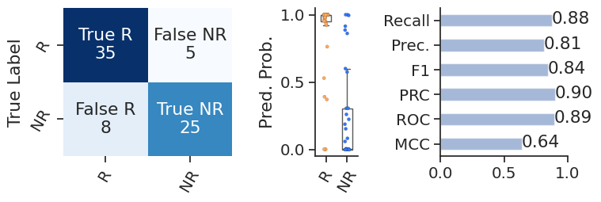

```python
import sys

sys.path.insert(0,  './tmpignore/conceptor')
from conceptor.utils import plot_embed_with_label
from conceptor import PreTrainer, FineTuner, loadconceptor #, get_minmal_epoch
from conceptor.utils import plot_embed_with_label, plot_performance, score2
from conceptor.tokenizer import CANCER_CODE
```


```python
import os
from tqdm import tqdm
from itertools import chain
import pandas as pd
import numpy as np
import random, torch
import matplotlib.pyplot as plt
import seaborn as sns
sns.set(style = 'white', font_scale=1.3)
import warnings
warnings.filterwarnings("ignore")

def onehot(S):
    assert type(S) == pd.Series, 'Input type should be pd.Series'
    dfd = pd.get_dummies(S, dummy_na=True)
    nanidx = dfd[dfd[np.nan].astype(bool)].index
    dfd.loc[nanidx, :] = np.nan
    dfd = dfd.drop(columns=[np.nan])*1.
    cols = dfd.sum().sort_values(ascending=False).index.tolist()
    dfd = dfd[cols]
    return dfd
```

## Download finetuned model
### dowanload the finetuner models from [here](https://drive.google.com/drive/folders/1G4hFZd90uBmggeBFWYDW-crX2wsvuah_)


```python
## load finetuner, your can load any finetuners
## finetuner_all_50.pt, finetuner_all_40.pt, finetuner_without_gide.pt
## Here we load finetuner_without_gide.pt to test the Gide cohort performance:

finetuner = loadconceptor('./tmpignore/finetuner_without_gide.pt')

## read data
df_label = pd.read_pickle('./tmpignore/ITRP.PATIENT.TABLE')
df_tpm = pd.read_pickle('./tmpignore/ITRP.TPM.TABLE')

df_label = df_label[df_label.cohort == 'Gide']
df_tpm = df_tpm.loc[df_label.index]

df_tpm.shape, df_label.shape
```


    ((73, 15672), (73, 110))


## Prepare model inputs


```python
dfcx = df_label.cancer_type.map(CANCER_CODE).to_frame('cancer_code').join(df_tpm)
df_task = onehot(df_label.response_label)
dfcx.head()
```


<div>
<style scoped>
    .dataframe tbody tr th:only-of-type {
        vertical-align: middle;
    }

    .dataframe tbody tr th {
        vertical-align: top;
    }

    .dataframe thead th {
        text-align: right;
    }
</style>
<table border="1" class="dataframe">
  <thead>
    <tr style="text-align: right;">
      <th></th>
      <th>cancer_code</th>
      <th>A1BG</th>
      <th>A1CF</th>
      <th>A2M</th>
      <th>A2ML1</th>
      <th>A4GALT</th>
      <th>A4GNT</th>
      <th>AAAS</th>
      <th>AACS</th>
      <th>AADAC</th>
      <th>...</th>
      <th>ZWILCH</th>
      <th>ZWINT</th>
      <th>ZXDA</th>
      <th>ZXDB</th>
      <th>ZXDC</th>
      <th>ZYG11A</th>
      <th>ZYG11B</th>
      <th>ZYX</th>
      <th>ZZEF1</th>
      <th>ZZZ3</th>
    </tr>
    <tr>
      <th>Index</th>
      <th></th>
      <th></th>
      <th></th>
      <th></th>
      <th></th>
      <th></th>
      <th></th>
      <th></th>
      <th></th>
      <th></th>
      <th></th>
      <th></th>
      <th></th>
      <th></th>
      <th></th>
      <th></th>
      <th></th>
      <th></th>
      <th></th>
      <th></th>
      <th></th>
    </tr>
  </thead>
  <tbody>
    <tr>
      <th>1_ipiPD1_PRE</th>
      <td>25</td>
      <td>5.23</td>
      <td>0.02</td>
      <td>82.96</td>
      <td>0.10</td>
      <td>0.75</td>
      <td>0.03</td>
      <td>27.57</td>
      <td>3.23</td>
      <td>0.04</td>
      <td>...</td>
      <td>10.48</td>
      <td>3.47</td>
      <td>0.70</td>
      <td>1.63</td>
      <td>2.43</td>
      <td>0.05</td>
      <td>2.98</td>
      <td>10.81</td>
      <td>6.30</td>
      <td>4.01</td>
    </tr>
    <tr>
      <th>2_ipiPD1_PRE</th>
      <td>25</td>
      <td>7.39</td>
      <td>0.00</td>
      <td>1154.40</td>
      <td>0.00</td>
      <td>0.95</td>
      <td>0.03</td>
      <td>48.91</td>
      <td>2.10</td>
      <td>0.01</td>
      <td>...</td>
      <td>17.20</td>
      <td>7.46</td>
      <td>0.44</td>
      <td>0.79</td>
      <td>5.81</td>
      <td>0.00</td>
      <td>5.02</td>
      <td>37.27</td>
      <td>13.47</td>
      <td>8.14</td>
    </tr>
    <tr>
      <th>6_ipiPD1_PRE</th>
      <td>25</td>
      <td>3.91</td>
      <td>0.00</td>
      <td>168.14</td>
      <td>0.11</td>
      <td>0.52</td>
      <td>0.01</td>
      <td>18.20</td>
      <td>2.08</td>
      <td>0.00</td>
      <td>...</td>
      <td>4.73</td>
      <td>1.54</td>
      <td>0.57</td>
      <td>1.06</td>
      <td>1.81</td>
      <td>0.01</td>
      <td>2.79</td>
      <td>4.11</td>
      <td>6.77</td>
      <td>3.74</td>
    </tr>
    <tr>
      <th>7_ipiPD1_PRE</th>
      <td>25</td>
      <td>1.85</td>
      <td>0.01</td>
      <td>80.62</td>
      <td>0.00</td>
      <td>0.21</td>
      <td>0.03</td>
      <td>4.82</td>
      <td>0.84</td>
      <td>0.06</td>
      <td>...</td>
      <td>4.07</td>
      <td>1.58</td>
      <td>0.44</td>
      <td>0.39</td>
      <td>0.87</td>
      <td>0.00</td>
      <td>2.00</td>
      <td>8.44</td>
      <td>2.20</td>
      <td>2.92</td>
    </tr>
    <tr>
      <th>8_ipiPD1_PRE</th>
      <td>25</td>
      <td>5.39</td>
      <td>0.00</td>
      <td>76.01</td>
      <td>0.02</td>
      <td>0.81</td>
      <td>0.09</td>
      <td>49.43</td>
      <td>3.93</td>
      <td>0.00</td>
      <td>...</td>
      <td>14.25</td>
      <td>10.21</td>
      <td>0.89</td>
      <td>1.91</td>
      <td>3.05</td>
      <td>0.03</td>
      <td>11.61</td>
      <td>17.74</td>
      <td>7.96</td>
      <td>18.08</td>
    </tr>
  </tbody>
</table>
<p>5 rows × 15673 columns</p>
</div>


## Make predictions


```python
dfe, df_pred = finetuner.predict(dfcx, batch_size = 16)
```

    100%|##########| 5/5 [00:00<00:00,  6.13it/s]


The prediction of the model contains 2 outputs. The first output is the score of the cell-type level concepts. The second is the predicted probability. 0 corresponds to non-response and 1 corresponds to response.


```python
## conceptor score
dfe.head()
```


<div>
<style scoped>
    .dataframe tbody tr th:only-of-type {
        vertical-align: middle;
    }

    .dataframe tbody tr th {
        vertical-align: top;
    }

    .dataframe thead th {
        text-align: right;
    }
</style>
<table border="1" class="dataframe">
  <thead>
    <tr style="text-align: right;">
      <th></th>
      <th>Adipocyte</th>
      <th>Apoptosis_pathway</th>
      <th>Bcell</th>
      <th>CANCER</th>
      <th>CD4_Tcell</th>
      <th>CD8_Tcell</th>
      <th>CPI_Response</th>
      <th>CPI_effect</th>
      <th>Cytokine_chemokine</th>
      <th>Cytotoxic_Tcell</th>
      <th>...</th>
      <th>Stem</th>
      <th>Stroma</th>
      <th>TGFb_pathway</th>
      <th>TLS</th>
      <th>TMB</th>
      <th>Tcell_exclusion</th>
      <th>Tcell_general</th>
      <th>Treg</th>
      <th>cDC</th>
      <th>pDC</th>
    </tr>
    <tr>
      <th>Index</th>
      <th></th>
      <th></th>
      <th></th>
      <th></th>
      <th></th>
      <th></th>
      <th></th>
      <th></th>
      <th></th>
      <th></th>
      <th></th>
      <th></th>
      <th></th>
      <th></th>
      <th></th>
      <th></th>
      <th></th>
      <th></th>
      <th></th>
      <th></th>
      <th></th>
    </tr>
  </thead>
  <tbody>
    <tr>
      <th>1_ipiPD1_PRE</th>
      <td>1.946114</td>
      <td>2.308815</td>
      <td>1.268282</td>
      <td>-0.543625</td>
      <td>1.952781</td>
      <td>2.179384</td>
      <td>1.341070</td>
      <td>1.850306</td>
      <td>2.191977</td>
      <td>1.561325</td>
      <td>...</td>
      <td>1.865696</td>
      <td>2.445551</td>
      <td>1.399902</td>
      <td>1.656181</td>
      <td>1.957647</td>
      <td>2.202881</td>
      <td>2.109776</td>
      <td>1.358847</td>
      <td>1.394624</td>
      <td>1.409620</td>
    </tr>
    <tr>
      <th>2_ipiPD1_PRE</th>
      <td>1.797584</td>
      <td>2.147074</td>
      <td>1.385810</td>
      <td>-0.543746</td>
      <td>1.896353</td>
      <td>2.264272</td>
      <td>0.690322</td>
      <td>1.905378</td>
      <td>2.098906</td>
      <td>1.571620</td>
      <td>...</td>
      <td>2.329527</td>
      <td>2.331889</td>
      <td>1.670644</td>
      <td>1.729452</td>
      <td>1.884305</td>
      <td>2.308213</td>
      <td>2.294847</td>
      <td>1.057095</td>
      <td>1.322861</td>
      <td>1.641564</td>
    </tr>
    <tr>
      <th>6_ipiPD1_PRE</th>
      <td>1.906188</td>
      <td>2.301974</td>
      <td>1.043642</td>
      <td>-0.543417</td>
      <td>1.945815</td>
      <td>2.360919</td>
      <td>1.212628</td>
      <td>1.899567</td>
      <td>2.061909</td>
      <td>1.662967</td>
      <td>...</td>
      <td>2.018662</td>
      <td>2.398139</td>
      <td>1.444633</td>
      <td>1.215814</td>
      <td>1.696890</td>
      <td>2.053318</td>
      <td>2.169455</td>
      <td>1.283464</td>
      <td>1.484758</td>
      <td>1.247126</td>
    </tr>
    <tr>
      <th>7_ipiPD1_PRE</th>
      <td>2.020110</td>
      <td>2.352570</td>
      <td>1.356010</td>
      <td>-0.543264</td>
      <td>1.973025</td>
      <td>2.315243</td>
      <td>1.371591</td>
      <td>1.970148</td>
      <td>2.251877</td>
      <td>1.642058</td>
      <td>...</td>
      <td>2.094480</td>
      <td>2.469353</td>
      <td>1.384351</td>
      <td>1.641669</td>
      <td>1.575712</td>
      <td>2.238491</td>
      <td>2.118487</td>
      <td>1.298826</td>
      <td>1.560758</td>
      <td>1.381392</td>
    </tr>
    <tr>
      <th>8_ipiPD1_PRE</th>
      <td>1.821828</td>
      <td>2.048581</td>
      <td>1.024990</td>
      <td>-0.543961</td>
      <td>1.918190</td>
      <td>2.438015</td>
      <td>0.937945</td>
      <td>1.834857</td>
      <td>2.089520</td>
      <td>1.717699</td>
      <td>...</td>
      <td>2.145675</td>
      <td>2.337186</td>
      <td>1.359336</td>
      <td>1.514439</td>
      <td>1.842595</td>
      <td>1.866308</td>
      <td>2.208838</td>
      <td>1.179389</td>
      <td>1.387992</td>
      <td>1.456456</td>
    </tr>
  </tbody>
</table>
<p>5 rows × 45 columns</p>
</div>


```python
## conceptor prediction probabilities
df_pred.head()
```


<div>
<style scoped>
    .dataframe tbody tr th:only-of-type {
        vertical-align: middle;
    }

    .dataframe tbody tr th {
        vertical-align: top;
    }

    .dataframe thead th {
        text-align: right;
    }
</style>
<table border="1" class="dataframe">
  <thead>
    <tr style="text-align: right;">
      <th></th>
      <th>0</th>
      <th>1</th>
    </tr>
    <tr>
      <th>Index</th>
      <th></th>
      <th></th>
    </tr>
  </thead>
  <tbody>
    <tr>
      <th>1_ipiPD1_PRE</th>
      <td>0.399619</td>
      <td>0.600381</td>
    </tr>
    <tr>
      <th>2_ipiPD1_PRE</th>
      <td>0.997979</td>
      <td>0.002022</td>
    </tr>
    <tr>
      <th>6_ipiPD1_PRE</th>
      <td>0.939994</td>
      <td>0.060006</td>
    </tr>
    <tr>
      <th>7_ipiPD1_PRE</th>
      <td>0.047343</td>
      <td>0.952657</td>
    </tr>
    <tr>
      <th>8_ipiPD1_PRE</th>
      <td>0.999004</td>
      <td>0.000996</td>
    </tr>
  </tbody>
</table>
</div>


## Analysis performance


```python
## masure the performance
dfp = df_task.join(df_pred)
y_true, y_prob, y_pred = dfp['R'], dfp[1], dfp[[0, 1]].idxmax(axis=1)
fig = plot_performance(y_true, y_prob, y_pred)
```


    

    


```python
roc, prc, f1, acc, mcc = score2(y_true, y_prob, y_pred)
print("Test performance:roc={:.3f},prc={:.3f}, f1={:.3f}, acc={:.3f}, mcc={:.3f}.".format(roc, prc, f1, acc, mcc))
```

    Test performance:roc=0.895,prc=0.903, f1=0.843, acc=0.822, mcc=0.640.


```python

```


```python

```


```python

```
